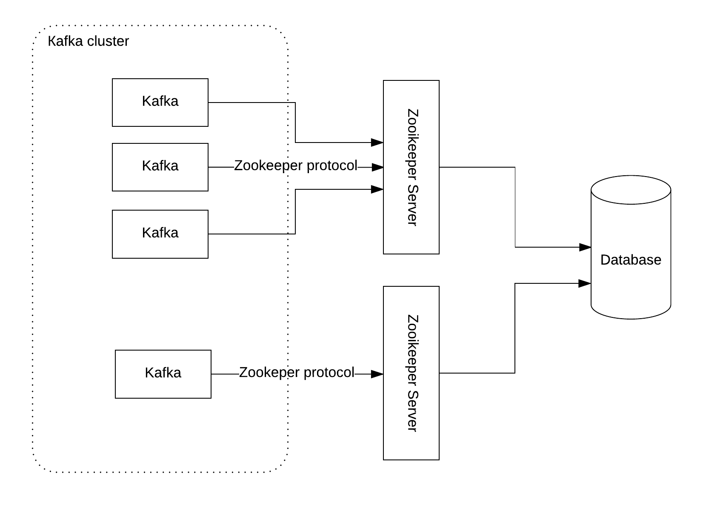
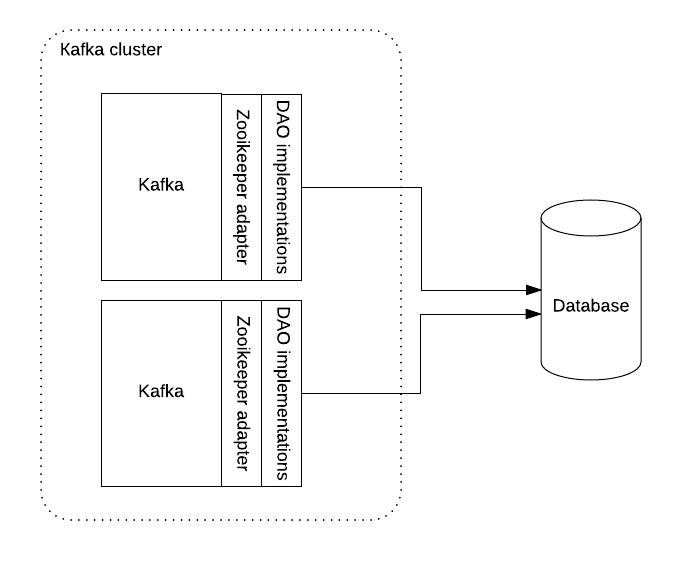

# Charlatan

Charlatan (from Dutch _zooi_ - mess, chaos) is a library created for Apache Kafka in order to
substitute real zookeeper with zookeeper imitation. 

## Motivation
Kafka is a great product, but it requires running Zookeeper cluster. This means that to manage 
Kafka cluster we need to manage also Zookeeper cluster.  
This complicates Kafka usage especially in case when we already have similar service. Such 
can be known product like etcd, consul, etc. or own highly available service.

Charlatan provides two options to use Kafka without zookeeper:
1. In stead of Zookeeper Kafka communicates with the different server using Zookeeper messaging 
protocol. This option was implemented in ***Charlatan-server*** sub-project.
2. In stead of Zookeeper driver Kafka uses Charlatan adapter that stores all zookeeper related
information in the relational database. In this case Kafka doesn't need other running service
and database can play the role of the highly available service. This option was implemented in 
***Charlatan-adapter*** sub-project.

## Sub-projects 
Charlatan contains from few sub-projects

Sub-project             |Description
------------------------|------------ 
[***Charlatan-common***](#charlatan-common)  |Watch management, session management, common dao interfaces.
[***Charlatan-server***](#charlatan-server)  |Netty based server implementation, zookeeper messaging protocol implementation
[***Charlatan-adapter***](#charlatan-adapter)|Fake zookeeper driver, it can be used as a Kafka dependency instead of zookeeper.jar.
[***Charlatan-sqlite***](#charlatan-dao-sqlite)  |Simple implementation of Charlatan DAO interfaces using sqlite. 
It is not  suitable for the production usage and it was build mainly for the demonstration purposes and testing purposes.
[***Charlatan-remote***](#charlatan-dao-remote)  |Simple netty based implementation of Charlatan DAO interfaces that sends DAO requests to the remote server

### Charlatan-common<a name="charlatan-common"></a>
In order to replace Zookeeper 
### Charlatan-server<a name="charlatan-server"></a>
This options supposes that standard Kafka distribution is used and instead of real Zookeeper
Kafka is pointed to the Charlatan server. The schema could look like: 

Note that as long as same database is used multiple Charlatan server can be running.
One or multiple Kafka instances can be connected to the Charlatan server. Kafka broker isn't aware that 
not a real Zookeeper is used. Standard Kafka setting ```zookeeper.connect``` is used in order to point Kafka to 
Charlatan server.  

In this example we are starting Charlatan server with sqlite DAO implementations 
and default implementation of WatchService and SessionService.
```java
String host = "localhost";
int port = 2181;

CharlatanNettyServer server = new CharlatanServerBuilder()
	// Charlatan server host
	.setHost(host)
	// Charlatan server port
	.setPort(port)
	// Charlatan server id must be unique per Charlatan cluster
	.setId("server"+port)
	.setWorkerCount(5)
	// Node DAO implementation
	.setNodeDao(new NodeDaoSqlite())
	// Watch service implementation
	.setWatchService(new WatchServiceImpl(NodeUpdateDaoSqlite(), new NamedThreadFactory("charlatan-watch-service")))
	// Session service implementation
	.setSessionService(new SessionServiceImpl(new SessionDaoSqlite()))
	.setThreadFactory(new NamedThreadFactory("charlatan-service"))
	.build();

server.start();
```

### Charlatan-adapter<a name="charlatan-adapter"></a>
This option supposes that in standard Kafka distribution zookeeper.jar library will be substituted 
with the charlatan-adapter.jar and charlatan dao implementation will be provided. 
What do we need to make it work?
1. Remove from Kafka distribution zookeeper jar located in libs/zookeeper-3.4.10.jar.
2. Place charlatan-adapter.jar in libs/ folder.
3. Place jar that contains your Charlatan DAO implementations in libs/ folder (charlatan-dao-sqlite.jar can be 
used for testing purposes).
<br>In runtime ***Charlatan-adapter*** uses DAO interface implementations found in the classpath. 
***Charlatan-adapter*** fails if no DAO implementation was found or multiple DAO implementations were found.

In case Charlatan DAO interfaces were implemented for relational database the schema would look like:


In more general approach Charlatan DAO interfaces implementation is a client to your highly available service.


### Charlatan-dao-sqlite<a name="charlatan-dao-sqlite"></a>
This project was created for testing purposes and contains basic Charlatan DAO implementations for sqlite database.
### Charlatan-dao-remote<a name="charlatan-dao-remote"></a>
This project was created for demonstration purposes only and contains Charlatan DAO implementation that acts as a client
 to the remote REST-full service. 
